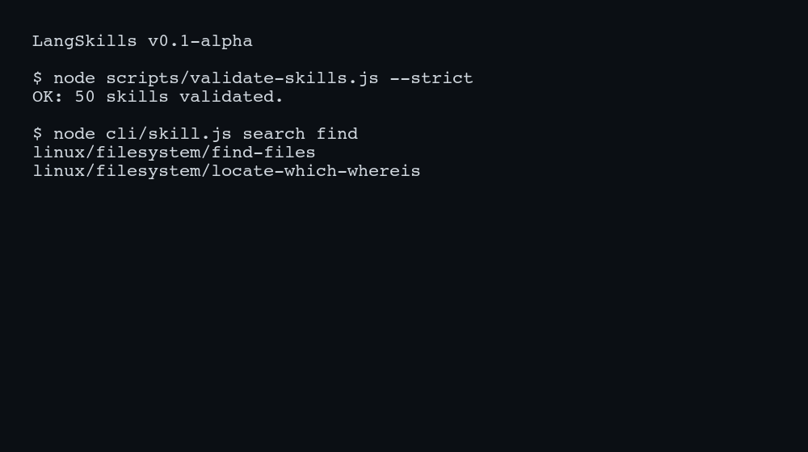

# LangSkills

[](https://github.com/LabRAI/LangSkills/actions/workflows/ci.yml)
[](https://github.com/LabRAI/LangSkills/actions/workflows/link-check.yml)
[](https://github.com/LabRAI/LangSkills/actions/workflows/build-site.yml)

LangSkills 把「可执行的 Agent Skill」当作一种可治理的数据资产：每条 skill 以 `skills/<domain>/<topic>/<slug>/`（或一次 run 的 `runs/<run-id>/skills/...`）目录存储，拆分为 `skill.md`（≤12 步 SOP + Verification + Safety + Sources）、`library.md`（可复制最小块）、`metadata.yaml`（索引/分级/过滤），并把来源证据与 LLM 生成过程落到 `reference/`（可审计、可复现）。

本仓库同时提供可长跑的「抓取→候选→整理→生成」流水线（`agents/`）与严格门禁（`scripts/validate-skills.js --strict`），以及网站/CLI/插件的统一分发面（`website/`,`cli/`,`plugin/`）。



## 快速开始

### 1) 环境

- Node.js >= 18（需要全局 `fetch()`）
- npm（可用 `npm ci` 安装依赖）

### 2) 安装依赖

```bash
npm ci
```

### 3) 配置 LLM（OpenAI-compatible）

在仓库根目录创建 `.env`（已在 `.gitignore`；不要提交到 git）：

```bash
OPENAI_BASE_URL=https://api.vveai.com
OPENAI_API_KEY=sk-...
OPENAI_MODEL=gpt-4o-mini
```

说明：`OPENAI_BASE_URL` 会自动补全为 `.../v1`（若你填写的是 host 根地址）。

### 4) 一键闭环生成（推荐：crawl → curate → skillgen → validate → summary）

```bash
bash scripts/closed-loop.sh --domain linux --run-id linux-demo --max-skills 10
```

生成 500 条（示例；并发 8）：

```bash
bash scripts/closed-loop.sh --domain linux --run-id linux-500 \
  --skip-repo-ingest --crawl-max-pages 200 --extract-max-docs 200 \
  --max-skills 500 --skillgen-concurrency 8
```

低成本 smoke（fixture cache + 不调用 LLM；仍会生成并跑 validator）：

```bash
CURATOR_LLM_PROVIDER="" SKILLGEN_LLM_PROVIDER="" bash scripts/closed-loop.sh \
  --domain linux --run-id linux-smoke \
  --cache-dir docs/fixtures/web-cache --crawl-max-pages 1 --extract-max-docs 1 \
  --skip-repo-ingest --max-skills 1
```

### 5) 查看产物（调试入口）

默认都在 `runs/<run-id>/`：

- `runs/<run-id>/logs/01..05_*.log`：每一步 stdout/stderr（排错入口）
- `runs/<run-id>/candidates.jsonl`：整理前原材料（网页 headings / repo ingest 等）
- `runs/<run-id>/curation.json`：curator 整理后的队列（含 LLM 更新统计）
- `runs/<run-id>/reports/skillgen.json`：本轮生成报告（含每条 skill 的 tokens/路径）
- `runs/<run-id>/skills/<domain>/README.md`：本轮生成列表（表格）
- `runs/<run-id>/closed_loop_report.json`：闭环总汇（推荐先打开）

每条 skill 目录：`runs/<run-id>/skills/<domain>/<topic>/<slug>/`（包含 `reference/materials/*` 与 `reference/llm/generate_skill.json`）。

### 6) 校验与审计

严格门禁（与 CI 对齐）：

```bash
node scripts/validate-skills.js --skills-root runs/<run-id>/skills --strict
```

列出本轮“skill 位置 + 错误/缺失项”（会生成 TSV + Markdown 报告）：

```bash
node scripts/audit-run.js --run-id <run-id>
```

输出：

- `runs/<run-id>/reports/audit_run.md`
- `runs/<run-id>/reports/skill_locations.tsv`

逐一确认本轮每个 source page（URL）的抓取/抽取/生成覆盖情况：

```bash
node scripts/audit-source-pages.js --run-id <run-id>
```

输出：

- `runs/<run-id>/reports/source_pages_audit.md`
- `runs/<run-id>/reports/source_pages_audit.tsv`

## 本地预览（可选：网站检索）

```bash
node scripts/build-site.js --out website/dist
node scripts/serve-site.js --dir website/dist --port 4173
# 打开：http://127.0.0.1:4173/
```

## 定向生成（已有 topic 配置）

如果只跑 `agents/configs/<domain>.yaml` 里定义的 topics（不走抓取发现），用 `scripts/run-topic.js`：

```bash
node scripts/run-topic.js --domain linux --topic filesystem/find-files --run-id linux-find
```

## 90 天长跑

```bash
node scripts/run-longrun.js --domain linux --run-id linux-90d --days 90 --pages-per-day 500
node scripts/verify-longrun.js --domain linux --run-id linux-90d --days 90 --pages-per-day 500 --strict
```

更多细节见：`docs/longrun_90d_runbook.md`

## 自检（可选）

```bash
node scripts/self-check.js --m0 --skip-remote
```

## 配置（数据源 / allowlist / topics）

- `agents/configs/sources.yaml`：来源注册表（seeds、refresh、license_policy）
- `agents/configs/<domain>.yaml`：domain 绑定 sources、allow/deny domains、topics 列表

## Prompt（可直接替换/润色）

- curator：`agents/curator/prompts/curate_proposals_v1.system.md` + `agents/curator/prompts/curate_proposals_v1.user.md`
- skillgen：`agents/skillgen/prompts/generate_skill_v1.system.md` + `agents/skillgen/prompts/generate_skill_v1.user.md`

## 进一步文档

- `docs/repo_inventory.md`：目录/模块总览
- `docs/skill-format.md`：Skill 标准
- `docs/taxonomy.md`：topic/tags 口径
- `docs/meeting_qa.md`：会议 Q1–Q6（证据链）
- `docs/curator_llm.md`：LLM 细节与 prompt capture
- `docs/license_policy.md`：License/合规策略
- `docs/mohu.md` + `docs/plan.md` + `docs/verify_log.md`：任务/验收记录

## 安全

见 `SAFETY.md`、`SECURITY.md`。
